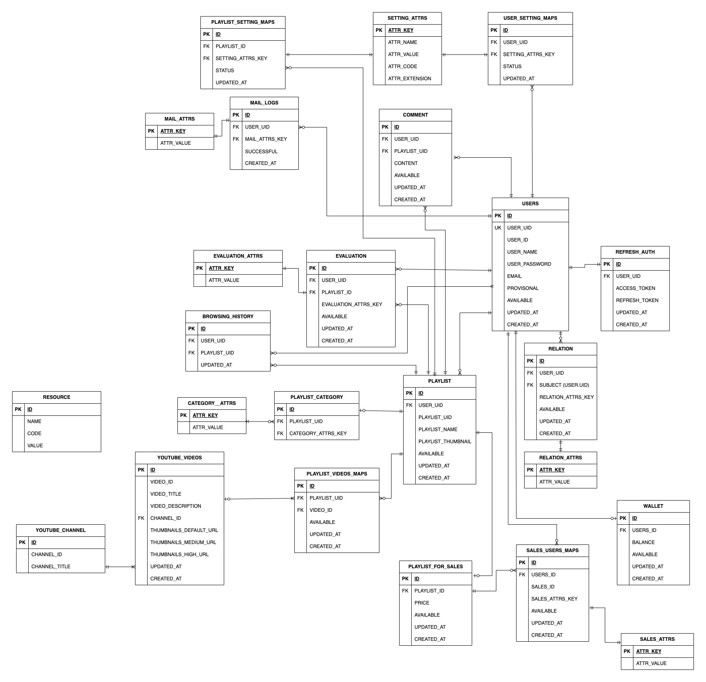

# はじめてのNext.js

  
  

動画プレイリスト共有サービス作成（一部未実装）

(利用規約に抵触する恐れがあり断念)

## 環境
- データベース：MySql
- バックエンド：PHP 7.4
- フロントエンド：Next.js
- ユーザインタフェース：Chakra UI / Swiper
- デザイン：Tailwind.css
- パッケージ管理：npm /  Composer
- API：YouTube Data API v3

## 実装機能

### 認証
ステートレス認証をすべく、JWT認証を採用。
ユーザ認証時、公開鍵暗号方式（RS256使用)において、デジタル署名を行なったアクセストークンをCookieにセット、リフレッシュトークンは、データベースにセット。
アクセストークンは30分、リフレッシュトークンは12日間を有効期限とし、アクセストークンのみ期限が切れた場合は、リフレッシュトークンによってアクセストークンを再発行する。リフレッシュトークンの有効期限が切れた場合は、ログインによりトークンを再発行する。

リクエストごとに、アクセストークンによる本人証明かつ改ざん検知を行なった。

withCredentials=trueとし、非ログインユーザ/ログインユーザ/自分自身を分岐処理。
- ログイン
- 新規登録
- 各種リクエスト処理

### ER図

